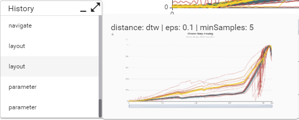
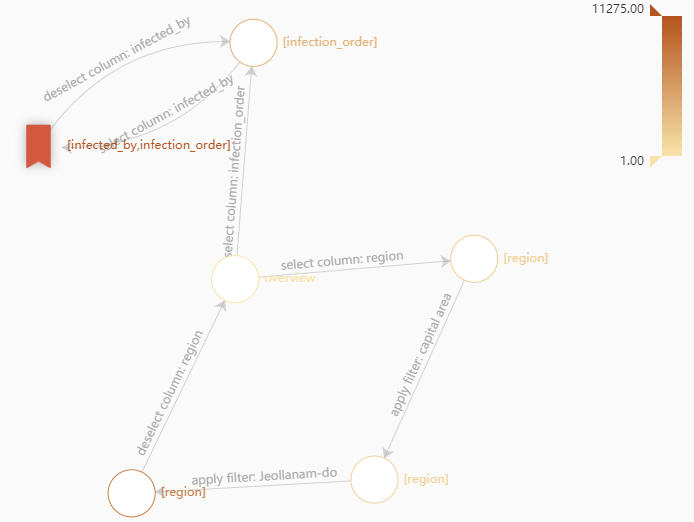

# gideon (Guided Exploration)

Gideon is a framework to record provenance and analyse recurring interaction pattern in web-based applications. Gideon allows to record a non-linear interaction graph that represents the history of interactions performed by a user while using an application.

Gideon consists of a frontend library to implement interaction recording in a web-based frontend and a backend service to store interactions and perform graph-algorithms on the recorded data.




## Examples

Example implementation for usage with [echarts library](https://echarts.apache.org/en/index.html) and [jointjs](https://www.jointjs.com/) graphs. Can be found in the ```frontend/projects/gideon/src/lib/exampes``` folder.
